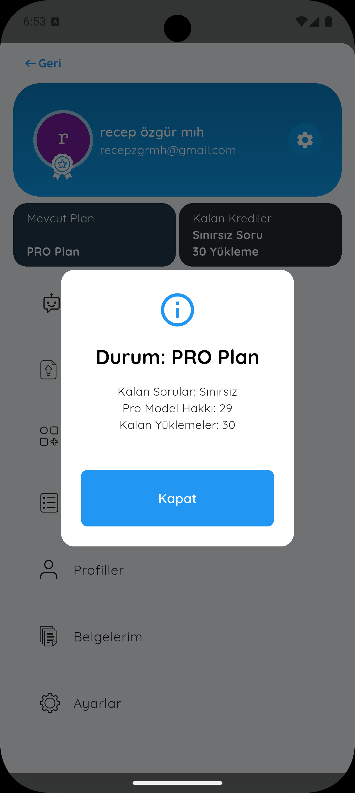
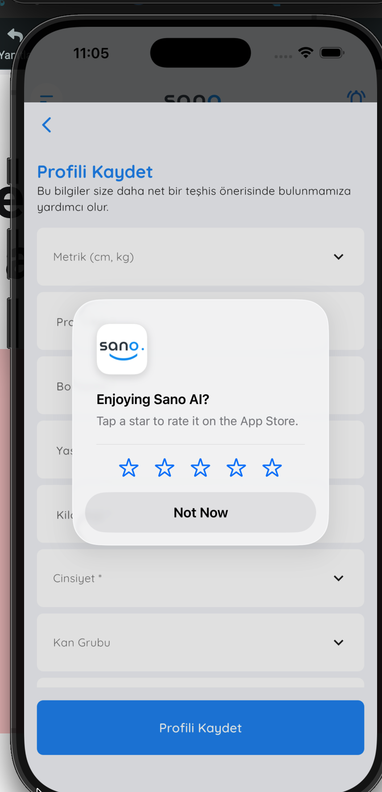
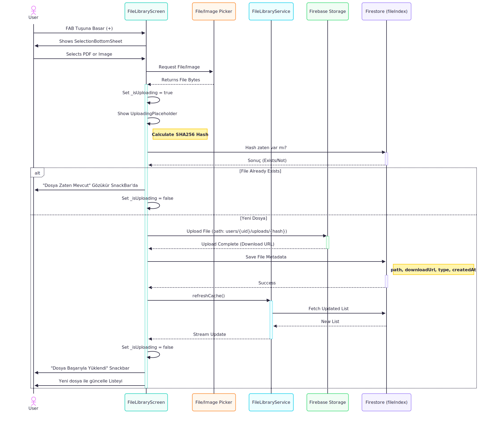
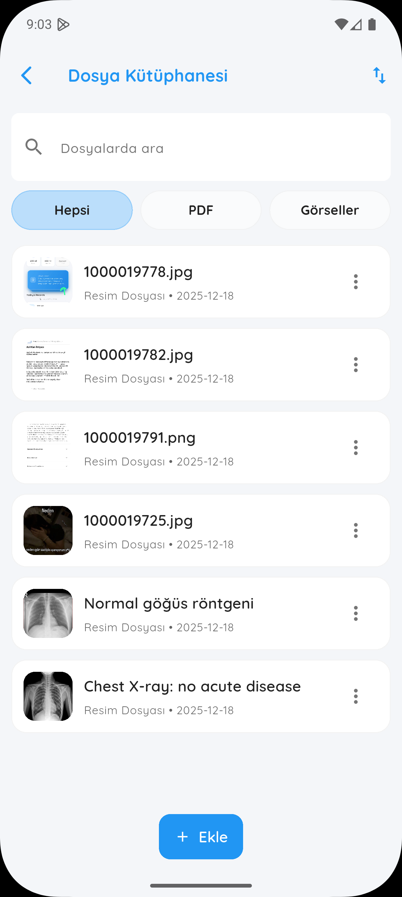
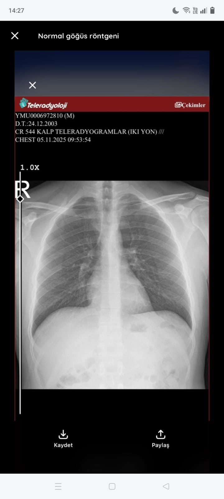
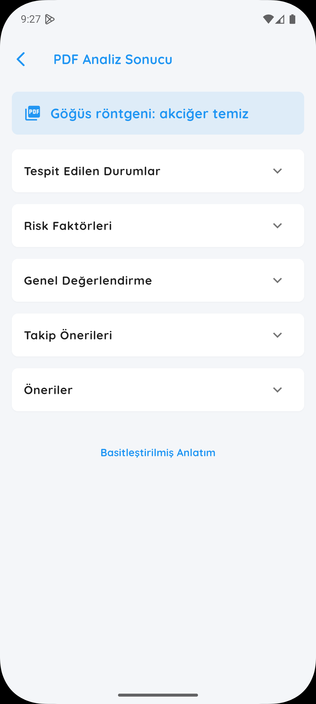

# 📋 Changelog

Bu projedeki tüm kayda değer değişiklikler bu dosyada belgelenecektir.

---

## [Unreleased]

### [2.1.4+128]

---

### Added

#### Belgelerim Sekmesi
- My_Drawer'a Belgelerim sekmesi eklendi buradan kullanıcı daha önce analiz etmiş olduğu tüm belgeleri görebiliyor. İsterse bu ekran üzerinden yeni dosya yüklemesi gerçekleştirebiliyor ve dosya analizlerine bu ekran üzerinden ulaşım sağlayabiliyor. Yüklemiş olduğu belgenin analizi yoksa yine bu ekran üzerinden analiz edebiliyor.

#### Dosya Hash & Duplicate Kontrolü
- Kullanıcı bir belge yüklediği zaman bu belge hashleniyor ve firebase üzerine yazılıyor
- Eğer kullanıcı daha önce yüklemiş olduğu bir belgeyi bir kez daha yüklemek isterse bu hash kontrol ediliyor. Eğer hash aynı çıkarsa kullanıcı bu belgeyi yükleyemiyor

#### Yeni Özellikler
- Geçmiş Sohbetler ekranına arama çubuğu eklendi

- Kullanıcıya gönderilen su takip bildirimlerinin sesi değişti:
  

    <audio controls>
      <source src="../assets/notifications/water_notification.mp3" type="audio/mpeg" />
      Tarayıcın audio etiketini desteklemiyor.
    </audio>
  

- IOS'da da, uygulama güncellendiğinde Android deki gibi uygulama güncelleme dialogu geliyor artık kullanıcının karşısına:
  

    
  

- Kullanıcıya expert modda kalan soru sayısı hakkı gösteriliyor. Artık expertUsage ve normalUsage olarak ayrılıyor veritabanında:
  

    
  

- Kullanıcıdan yorum istemek amacıyla kullanıcının karşısına şu şekilde bir dialog çıkarıyoruz;
  

    
  

---

#### 📊 Upload Akışı (Hash + Dedup + Storage)

  

---

#### Belge İsimlendirme

Kullanıcının yüklemiş olduğu belgenin ismi bu ekranda:
- Eğer analiz olmadan direkt yüklerse → dosyanın telefondaki ismi
- Eğer analiz ettiyse → analizde dosya için oluşturulan isim

---

#### Belgelerim Ekranı Özellikleri

<table>
  <tr>
    <td style="vertical-align: top; width: 70%;">
      

        

          <strong>Bu ekran şunları içermektedir:</strong>  
          • Bütün belgeleri görüntüleme 
          • PDF / görsel ayrımı 
          • İlgili belgeye tıklayınca açılan show bottom sheet modal 
          • Dosyanın analizi varsa açılan bottom sheet içerisinde "Analize git" seçeneği 
          • Dosyanın analizi yoksa "Analiz et" butonu 
          • Dosyayı silme seçeneği 
          • Yeni → Eski sıralama 
          • Dosyalarda arama gerçekleştirme 
          • Kullanıcı dosya yüklediği zaman skeletonizer 
          • Kullanıcı ilk kez bu sayfaya girdiği zaman skeletonizer
        

      

    </td>
    <td style="vertical-align: top; width: 30%;">
      
    </td>
  </tr>
</table>

---

#### PDF ve Resim Görüntüleme

  
  
  
  

---

#### Yeni Eklenen Paketler

| Paket | Versiyon |
|-------|----------|
| [crypto](https://pub.dev/packages/crypto) | ^3.0.7 |
| [cached_network_image](https://pub.dev/packages/cached_network_image) | ^3.4.1 |
| [skeletonizer](https://pub.dev/packages/skeletonizer) | ^2.1.2 |
| [firebase_storage](https://pub.dev/packages/firebase_storage) | ^12.4.10 |
| [syncfusion_flutter_pdfviewer](https://pub.dev/packages/syncfusion_flutter_pdfviewer) | ^29.2.7 |
| [in_app_review](https://pub.dev/packages/in_app_review) | ^2.0.10 |

---

### Changed

- Kullanıcının yüklemiş olduğu her türlü dosya Firebase Storage'da saklanıyor

- Firebase Storage kullanımını azaltmak için (maliyeti optimize etmek için) kullanıcının yüklemiş olduğu belgeler her görüntülemede download etmek yerine SharedPreferences ile kullanıcının cihazına kaydediliyor:
  - Kullanıcı uygulamayı her yeniden açtığında bu cache okunuyor Storage üzerinden okuma gerçekleştirilmiyor
  - Kullanıcı ancak ve ancak uygulamadaki hesabından çıkış yaparsa bu bilgiler cache'den siliniyor

- AnalysisResultScreen Renkleri değiştirildi

- Belirli yaştaki kullanıcıların kalori takibi yapması engellendi. Sebebi: [kaynak](https://www.quora.com/Being-under-18-restricts-my-access-to-websites-for-calculating-caloric-maintenance-Can-the-Shofield-equation-x-1-26-be-relied-upon-as-a-valid-method-for-determining-caloric-maintenance-for-a-15-year-old-like-me)

  
  

- Tüm kullanıcılar artık anonim bir şekilde trackerları kullanabiliyor ancak 3 kez herhangi bir işlem yaparsa karşısına hesabını yedeklemesi için bir dialog çıkıyor:
  

    
  

---

### Fixed

<table>
  <tr>
    <td style="vertical-align: top; width: 70%;">
      

        

          <strong>Düzeltilen Hatalar:</strong>  
          • Kullanıcı PDF analizi yaptıktan sonra, eski sohbetler ekranından görüntülerken oluşan parse hatası düzeltildi.  
          • Eski yapıda kalan <code>AnalysisDetailedScreen</code> kaldırıldı; PDF analizinden sonra açılan <code>AnalysisResultScreen</code> public yapıldı ve artık bu ekran kullanılıyor.
        

      

    </td>
    <td style="vertical-align: top; width: 30%;">
      
    </td>
  </tr>
</table>

---

